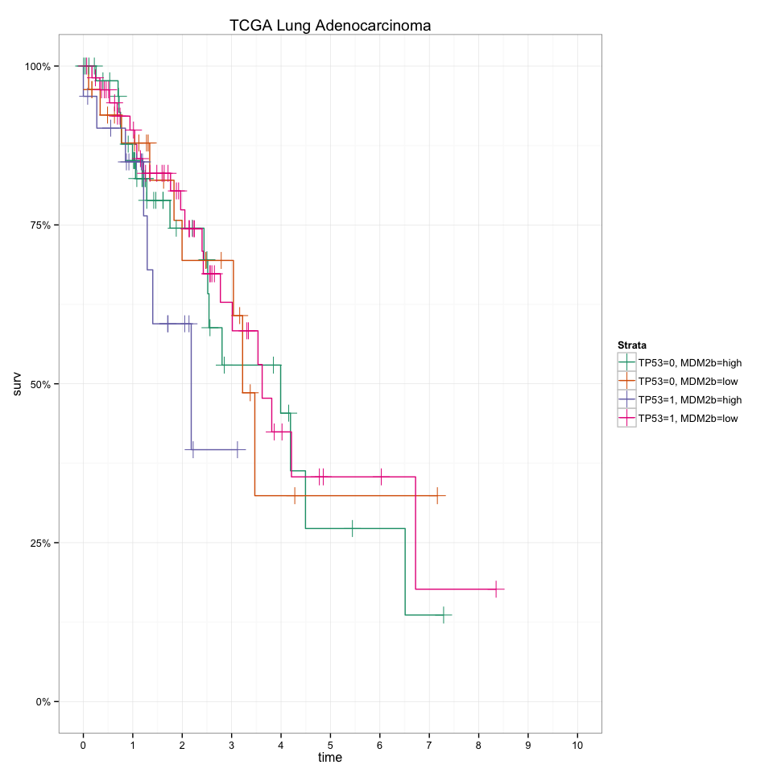

# Using `RTCGA.PANCAN12` package to compare time to death for selected tumor types
Przemyslaw Biecek  
`r Sys.Date()`  


# RTCGA.cnv package

You need RTCGA.PANCAN12 package to use PANCAN12 data from Cancer Genome Browser.


```r
require(devtools)
if (!require(RTCGA.PANCAN12)) {
    install_github("mi2-warsaw/RTCGA.data", subdir = "RTCGA.PANCAN12")
    require(RTCGA.PANCAN12)
}
```

# Expression

Expression data is divided and stored in two datasets, because it was too big to fit GitHub limits.
So first you need to do is to bind both data sets into one.


```r
expression.cb <- rbind(expression.cb1, expression.cb2)
```

Now, let's see where is expression for MDM2 and let's create a dataset with single column single  - MDM2 expression.


```r
grep(expression.cb[,1], pattern="MDM2")
```

```
[1] 8467
```

```r
MDM2 <- expression.cb[8467,-1]
MDM2v <- t(MDM2)
```

# Mutations

Mutations are stored in mutation.cb and they are coded 0/1.
Let's gather all mutations for TP53 and then let's create a data frame with single column - only for TP53?


```r
grep(mutation.cb[,1], pattern="TP53$", value = FALSE)
```

```
[1] 18475
```

```r
TP53 <- mutation.cb[18475,-1]
TP53v <- t(TP53)
```

# Merging

From clinical data we are going to extract following variables:
- X_cohort (cancer type)
- X_EVENT (0/1)
- X_TIME_TO_EVENT (in days)
- X_PANCAN_UNC_RNAseq_PANCAN_K16 (cancer's subtypes)

And then we merge clinical, expression and mutation datasets.
Not that it requires some data cleaning (in clinical data _ is used as a separator while in expression and mutation it's .).


```r
dfC <- data.frame(names=gsub(clinical.cb[,1], pattern="-", replacement="."), clinical.cb[,c("X_cohort","X_TIME_TO_EVENT","X_EVENT","X_PANCAN_UNC_RNAseq_PANCAN_K16")])
dfT <- data.frame(names=rownames(TP53v), vT = TP53v)
dfM <- data.frame(names=rownames(MDM2v), vM = MDM2v)
dfTMC <- merge(merge(dfT, dfM), dfC)
colnames(dfTMC) = c("names", "TP53", "MDM2", "cohort","TIME_TO_EVENT","EVENT","PANCAN_UNC_RNAseq_PANCAN_K16")
dfTMC$TP53 <- factor(dfTMC$TP53)

# only primary tumor
# (removed because of Leukemia)
# dfTMC <- dfTMC[grep(dfTMC$names, pattern="01$"),]
```

# MDM2 and TP53

First let's see the MDM2 expression along cancers.


```r
library(ggplot2)
quantile <- stats::quantile
ggplot(dfTMC, aes(x=cohort, y=MDM2)) + geom_boxplot() + theme_bw() + coord_flip() + ylab("")
```

 

And let's see the fraction of TP53 in cancers


```r
ggplot(dfTMC, aes(x=cohort, fill=TP53)) + geom_bar() + theme_bw() + coord_flip() + ylab("")
```

 

And how many cases for particular cancer types?


```r
knitr::kable(as.data.frame(sort(table(dfTMC$cohort))))
```

                                                        sort(table(dfTMC$cohort))
-----------------------------------------------------  --------------------------
TCGA Formalin Fixed Paraffin-Embedded Pilot Phase II                           10
TCGA Rectal Cancer                                                             67
TCGA Bladder Cancer                                                            95
TCGA Glioblastoma                                                             148
TCGA Colon Cancer                                                             149
TCGA Ovarian Cancer                                                           161
TCGA Lung Adenocarcinoma                                                      166
TCGA Acute Myeloid Leukemia                                                   170
TCGA Lung Squamous Cell Carcinoma                                             177
TCGA Endometrioid Cancer                                                      241
TCGA Head and Neck Cancer                                                     299
TCGA Kidney Clear Cell Carcinoma                                              397
TCGA Breast Cancer                                                            748

# Survival in different cancer types given MDM2 and TP53

Let's dichotomize MDM2 into two groups with the cutoff =0 (almost median).


```r
dfTMC$MDM2b <- cut(dfTMC$MDM2, c(-100,0,100), labels=c("low", "high"))
```

Number of cases


```r
library(dplyr)
library(tidyr)
dfTMC %>% 
  group_by(MDM2b, TP53, cohort) %>%
  summarize(count=n()) %>%
  unite(TP53_MDM2, TP53, MDM2b) %>%
  spread(TP53_MDM2, count, fill = 0)
```

```
Source: local data frame [13 x 5]

                                                 cohort 0_high 0_low 1_high 1_low
1                           TCGA Acute Myeloid Leukemia    150     7     11     2
2                                   TCGA Bladder Cancer     34    13     13    35
3                                    TCGA Breast Cancer    318   182     58   190
4                                     TCGA Colon Cancer     41    37     10    61
5                              TCGA Endometrioid Cancer    129    44     14    54
6  TCGA Formalin Fixed Paraffin-Embedded Pilot Phase II      6     1      0     3
7                                     TCGA Glioblastoma     45    55      6    42
8                             TCGA Head and Neck Cancer     52    36     49   162
9                      TCGA Kidney Clear Cell Carcinoma    310    79      3     5
10                             TCGA Lung Adenocarcinoma     50    33     23    60
11                    TCGA Lung Squamous Cell Carcinoma     24    12     64    77
12                                  TCGA Ovarian Cancer      2     3     28   128
13                                   TCGA Rectal Cancer     11    13      2    41
```

For four cancers with largest number of cases let's see Kaplan Meier curves divided into MDM2/TP53 groups.

Comments:

For Breast there is a very nice relation between high MDM2/mutated TP53 and survival. Outcomes for first 5 years are much worse.

For Kidney mutations in TP53 are uncommon, but both groups have bad prognosis.

For Head and Neck mutations in TP53 have bad prognosis and id MDM2 is high the prognosis is even worse.

For Endomeroid the interesting group is very small, for Lung there is no clear pattern. Remaining cancers are very small.


```r
library(survey)
library(scales)
library(survMisc)

# cancer = "TCGA Breast Cancer"
cancers <- names(sort(-table(dfTMC$cohort)))

for (cancer in cancers[1:11]) {
  survp <- survfit(Surv(TIME_TO_EVENT/356,EVENT)~TP53+MDM2b, data=dfTMC, subset=cohort == cancer)
  pl <- autoplot(survp, title = "")$plot + theme_bw() + scale_x_continuous(limits=c(0,10), breaks=0:10) + ggtitle(cancer) + scale_y_continuous(labels = percent, limits=c(0,1))
  cat(cancer,"\n")
  plot(pl)
}
```

```
TCGA Breast Cancer 
```

 

```
TCGA Kidney Clear Cell Carcinoma 
```

 

```
TCGA Head and Neck Cancer 
```

 

```
TCGA Endometrioid Cancer 
```

 

```
TCGA Lung Squamous Cell Carcinoma 
```

 

```
TCGA Acute Myeloid Leukemia 
```

 

```
TCGA Lung Adenocarcinoma 
```

 

```
TCGA Ovarian Cancer 
```

 

```
TCGA Colon Cancer 
```

 

```
TCGA Glioblastoma 
```

 

```
TCGA Bladder Cancer 
```

 

